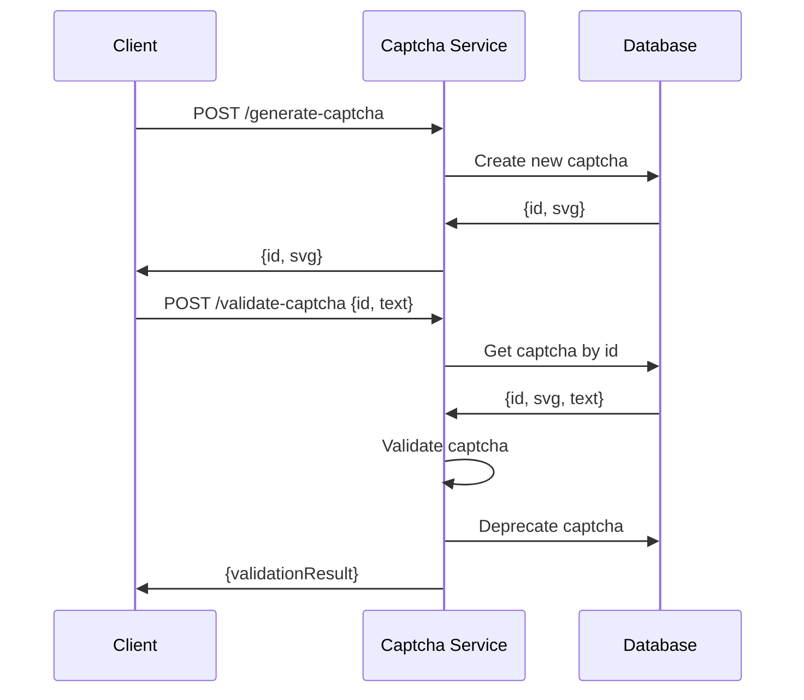

# Captcha Service Overview

The microservice allows to generate new captchas and to validate previously generated captchas against an input text. It exposes a synchronous HTTP REST API with two endpoints: [POST /generate-captcha](#post-generate-captcha) and [POST /validate-captcha](#post-validate-captcha).

The following diagram shows how the Captcha service works.

## Sequence diagram

