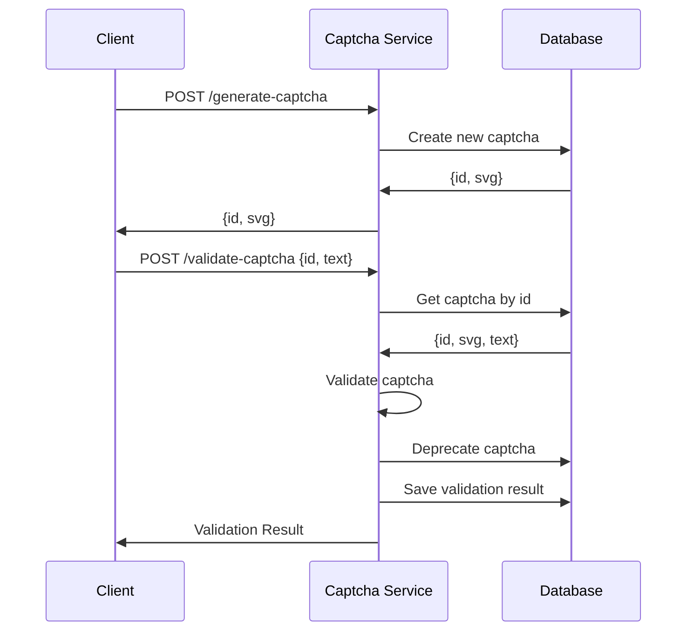

# Captcha Service Usage

The document describes how to use the Captcha Service.

The microservice allows to generate new captchas and to validate previously generated captchas against an input text. It exposes a synchronous HTTP REST API with two endpoints: [POST /generate-captcha](#post-generate-captcha) and [POST /validate-captcha](#post-validate-captcha).

## Sequence diagram



## Endpoints

### POST /generate-captcha

The endpoint generates a new captcha.

Even if no body is necessary in the request, this endpoint is designed with a POST verb in order to explicitly suggest to the user that it creates a new captcha document. It does not simply read existing data.

#### Request

The request has no body.

#### Response

In case of success the response has a status code of `200` and a body with the newly generated captcha id and the captcha svg.

```json
{
  "id": {"type": "string"},
  "svg": {"type": "string"}
}
```

### POST /validate-captcha

The endpoint validates a captcha against a text.

#### Request

The request body contains the id of the captcha and a text that must be validated against it.

```json
{
  "id": {"type": "string"},
  "text": {"type": "string"}
}
```

#### Response

In case of a successful validation the response has a `200` status code and the following body:

```json
{"success": true}
```

In case of a failed validation the response has a `400` status code and the following body:

```json
{"success": false}
```

